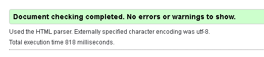

# Robinson Trailers Blog

A blog dedicated to a real trailers manufacturing company.

The company is Manufacturers and Suppliers of a complete range of Trailers and Equipment. The company headquarter is in Portarlington Co. Laoise Ireland.

I chose this company for my project because I work for it on part time. 
The company offers many different trailers for different sectors, for example I have listed these sectors in the dropdown menu call categories like forestry, construction or special orders. My blog was created to introduce the company and also to give other users the opportunity to share other trailer ideas and technologies.

This project is the fourth out of four Milestone Projects in the Full Stack Web Development Program I am attending at The Code Institute.

[View the live project here.](https://8000-fabrizioadi-robinsontra-ncwlke3bzcf.ws-eu46.gitpod.io/)
[Heroku app link](https://robinson-trailers-blog.herokuapp.com/)

- [Table of Content](#table-of-content)
  * [User Experience (UX)](#user-experience--ux-)
    + [Project goals](#project-goals)
    + [Business goals](#business-goals)
    + [User Goals](#user-goals)
    + [Site Owner goals](#site-owner-goals)
    + [Target audience](#target-audience)
  * [User Stories](#user-stories)
      - [Visitor goals:](#visitor-goals-)
      - [Admin goals:](#admin-goals)
  * [Structure](#structure)
  * [Design](#design)
  * [Existing Features](#existing-features)
      - [Features left to implement in the future](#features-left-to-implement-in-the-future)
  * [Technologies used](#technologies-used)
      - [Languages](#languages)
      - [Applications, Libraries and Platforms](#applications--libraries-and-platforms)
      - [Databases](#databases)
      - [Testing tools](#testing-tools)
  * [Validation](#validation)
  * [Deployment](#deployment)
      - [GitHub Repository](#github-repository)
      - [Making a Local Clone](#making-a-local-clone)
      - [Heroku Deployment](#heroku-deployment)
      - [Cloudinary Setup](#cloudinary-setup)
      - [AWS S3](#aws-s3)
      - [Google API](#google-api)
  * [Credits](#credits)
  * [Reference](#reference)

<small><i><a href='http://ecotrust-canada.github.io/markdown-toc/'>Table of contents generated with markdown-toc</a></i></small>

## User Experience (UX)

### Project goals

* Main goal was making a full-stack site based around business logic used to control a centrally-owned database.
* The site provides an authentication mechanism for Login, Logout, Registration. Person who is not a user of the site cannot edit or delete other users' blogs. These functions are also hidden from unlogged users.
* Making a full-stack site that uses HTML, CSS, JavaScript, Python + Django.
* Creating a website that uses a relational database.
* Creating a website which encourages to add engineering and technological blogs regarding trailers or maybe describe some components needed for construction.

### Business goals

* Creating a secure and professional website using authentication.
* Provide product for different sectors in transport.
* Makes introduce and promotion for the company.
* Makes accessible to everyone even for those who are not related to the transport sector, as blogs are displayed for everyone.

### User Goals

* Check the latest trailers available on the market.
* Check the latest ideas and solutions for a specific sector.
* See what the new design looks like.

### Site Owner goals

* Editing and adding newly produced trailers with their descriptions.

### Target audience

* Everyone who loves trucking.
* Blog dedicated to the transport sector.
* Blog dedicated to the Construction sector.
* Blog dedicated to the Forestry sector.

## User Stories

#### Visitor goals:

1. Availability on various devices.
As a visitor, I can access the website from any device, so that I have access to the website on desktop, tablet and mobile.
2. Trailers Informations.
As a visitor, I can read more information about the trailers (description, images), so that I can see if the product is right for me and meets the company's needs.
3. View Post.
As a visitor, I can view a list of posts, so that I can select one to read and see the other reviews.
4. Open a Post 
As a visitor, I can click on a post, so that I can read the full text.
5. Social Media
As a visitor, I can access the social media accounts of the company, so that I can follow them and see the latest updates.
6. Website Navigation
As a visitor, I can be able to navigate easily through the website, so that I can find everything easily.
7. General Information
As a visitor, I can read and know more about the company, so that I know what the company is about.
8. Contact, Asking Questions
As a visitor, I can be able to contact the owner/admin of the company website, so that I can easily ask a question.
9. Account Registration
As a visitor, I can register an account, so that I can leave comment or like and be up to date about the latest news.
10. Search/Filter 
As a visitor, I can search or filter by category diffrent type of trailers, so that I can find specific trailer quick and easy.
11. Add Blog Post
As a visitor/user, I can add a blog post relevant to the website, so that I can share my knowledge with other users.
12. Edit/Update Post
As a visitor/user, I can edit or update my blog post, so that I can be sure that the blog page will have the latest news, and I can also correct errors.
13. Delete Blog Post
As a visitor/user, I can delete blog which has been on the page too long, so that I can delete old blog post.
14. Login
As a visitor/user, I can simple login to the website, so that I have access to all available options.

#### Admin goals:

1. As admin, I want to add new blog posts, so that I would be up to date all the time with new information.
2. As admin, I want to edit blog post, so that I can manage the blogs and correct errors.
3. As admin, I want to delete blog post, so that I can delete old one or delete a blog that is not relevent.
4. As admin, I want to manage the users, so that I can removing account of person who breaks the regulations or behaves incorrectly.

## Structure

1. Home

## Design 

1. Frameworks
The Bootstrap front-end framework is used through the project. Bootstrap provides a quick design, responsive grid system, extensive prebuilt components and a modern interface for the project.
2. Images
The images that are used for the project are from my folder galery. The images is used for trailers blog images, open the post.
3. Fonts
4. Colour
The colours that are used for the website are very simple and calm colours. These colours are used because the colours give a sleek and modern look. The trailers stand out of the calm and sleep appearance of the colours. I always based on a black background and white letters which makes the text easier to read.

## Existing Features

1. The Navbar

2. Home Page

3. Category Dropdown Menu
* Forestry
* Construction
* Special

4. Footer

* The social media links are placed at the bottom of the footer.

5. Django-Allauth features

* Sign up

Users can create a new account by filling in a from where the user have to fillin a email, username, password and password confirmation. If the info already exists there will be a message that he/she already has an account. The user can submit the form when the data is new. A verification email is sent to the user.

* Login

Users can login with their username ans password. There is also a link to change the password, if the user is forgotten it.

* Forgot password
A user can reset their password.

* Logout
The user can logout by clicking the logout link. After clicking the link there wil a confirmation if the user is sure to logout.

6. Add posts

7. Edit posts

8. Delete posts

9. Post Detail Page

 Contact (Features)

#### Features left to implement in the future

1. Contact
2. Comments
3. Logging in with social media account, such as Facebook and Google.

## Technologies used

#### Languages

* Python 3.8 was used for backend of the project.
* HTML5 was used for building all web pages.
* jQuery is used for implementation of Bootstrap.
* CSS3 used for styling the website.
* JavaScript for alert and location fnunctionality.
* Jinja provides the templating language for Python.

#### Applications, Libraries and Platforms

* This project is built through the framework Django.
* GitPod is used to develop the project. All code was written and tested with the Gitpod web-based IDE.
* Git control system was used for version control to commit to Git and push to GitHub.
* GitHub projects repository is used to host the project.
* Heroku is used to host the project/Used to deploy the application.
* Bootstrap 5 as a framework used for styling.
* Pip3 is used for installing the necessary tools, libraries and frameworks.
* Spycopg2 is used to enable the PostGreSQL database to connect with Django.
* AWS Amazon used to store static and media files.(CSS and JavaScript)
* Boto3 is used for compatibility in AWS.
* Gunicorn is used to enable deployment to Heroku.
* Google Fonts is used to provide the font roboto for all the text that is used in the project.
* Font Awesome fonts were used for all icons in this project.
* Figma/Balsamiq used to create the mockup designs for the project. 
* Django Crispy Forms is used to style the Django forms
* Cloudinary - Cloud Platform used for images storage.

#### Databases

* PostgreSQL is used as the production database. For deployment, I used the PostgreSQL database whcih is provided by Heroku.
* SQlite3 is used as the development database. During the development phase I have worked with the sqlite3 database, which was set by default by Django.

#### Testing tools

* Chrome DevTools is used to detect problems and test responsiveness.
* Autoprefixer is used to parse the CSS and to add vendor prefixes to CSS rules.
* W3C Markup Validation Service
* The W3C Markup Validation Service is used to check whether there were any errors in the HTML5 code.
* W3C CSS validator
* The W3C CSS validator is used to check whether there were any errors in the CSS3 code.
* JShint is a JavaScript validator that is used to check whether there were any errors in the JavaScript code.
* The PEP8 validator is used to check whether there were any errors in the Python code.

## Validation

* Chrome DevTools is used to detect problems and test responsiveness.
* Autoprefixer is used to parse the CSS and to add vendor prefixes to CSS rules.
* W3C Markup Validation Service is used to check whether there were any errors in the HTML5 code.
* W3C CSS validator is used to check whether there were any errors in the CSS3 code.
* JShint is a JavaScript validator that is used to check whether there were any errors in the JavaScript code.
* PEP8 validator is used to check whether there were any errors in the Python code.

1. PEP8 Validation [Link](http://pep8online.com/)

Most of the errors that were shown concerned:
* Missing whitespace around operator
* Expected 2 blank lines, found 1

2. HTML Validation [Link](https://validator.w3.org/)

I tested the HTML code by running my server locally by port 8000 and used view page source. This code I passed through the validator. There was a five the same error -img element must have an alt attribute.

After correcting errors validator show that code passed and there where no errors.

3. CSS Validation [Link](https://jigsaw.w3.org/css-validator/)

No big errors found.
I got this message: This document is a properly written CSS version 3 + SVG.

4. JS Hint [Link](https://jshint.com/)

No errors found. Only some warnings.

5. Lighthouse testing

I used the automated tool Lighthouse to test the quality of the web pages.

Results:

6. Devices

7. Testing for User Stories

## Deployment

#### GitHub Repository

1. Access your GitHub account and find the relevant repository.
2. Click on 'Fork' on the top right of the page.
3. You will find a copy of the repository in your own Github account.

#### Making a Local Clone

1. Access your GitHub account and find the relevant repository.
2. Click the 'Code' button next to 'Add file'.
3. To clone the repository using HTTPS, under clone with HTTPS, copy the link.
4. Open Git Bash.
5. Access the directory you want the clone to be have.
6. In your IDE's terminal type 'git clone' and the paste the URL you copied.
7. Press Enter.
8. You now have a local clone.

#### Heroku Deployment

1. Create an account at heroku.com
2. Create a new app, add app name and your region
3. Click on create app
4. Go to "Settings"
5. Under Config Vars, add your sensitive data (creds.json for example)
6. For this project, I set buildpacks to and in that order.
7. Go to "Deploy" and at "Deployment method", click on "Connect to Github"
8. Enter your repository name and click on it when it shows below
9. Choose the branch you want to buid your app from
10. If desired, click on "Enable Automatic Deploys", which keeps the app up to date with your Github repository

Manualy deploy to heroku from gitpod workspace.

1. Open the terminal.
2. For those of you who are using MFA/2FA: please scroll down to see the additional steps required.
For those of you not using MFA/2FA: Log in to Heroku and enter your details.
command: heroku login -i
3. Get your app name from heroku.
command: heroku apps
4. Set the heroku remote. (Replace <app_name> with your actual app name and remove the <> characters)
command: heroku git:remote -a <app_name>
5. Add and commit any changes to your code if applicable
command: git add . && git commit -m "Deploy to Heroku via CLI"
6. Push to both GitHub and Heroku
command: git push origin main
command: git push heroku main

#### Cloudinary Setup

1. Visit the Cloudinary website
2. Click on the Sign Up For Free button
3. Provide your name, email address and choose a password
4. For Primary interest, you can choose Programmable Media for image and video API
5. Optional: edit your assigned cloud name to something more memorable
6. Click Create Account
7. Verify your email and you will be brought to the dashboard

#### AWS S3

1. Create an account at aws.amazon.com
2. Navigate to the IAM application and create a user and group
3. Set the AmazonS3FullAccess for the user and copy the AWS ACCESS and SECRET keys as config vars to your workspace and deployment environment
4. Create a new Bucket within the S3 application with an appropriate name.
5. Enable public access for your bucket so users can access and use the services on your website (upload, view, download, etc). More info can be read in the official documentation: https://aws.amazon.com/s3/

#### Google API

1. Login or create a Google account and navigate to https://console.cloud.google.com/
2. Create a new Project by clicking on the New Project icon
3. Add Project name and details
4. Under API's and services, enable the relevant API for your project (in this case Google Drive, Sheets and Calendar)
5. IF the API requires, create a credential (service account in this case) for your project
6. Save the API key as a secret in config vars in your workspace and deployment environment
7. Under API's and services, enable the relevant API for your project (in this case Google Drive, Sheets and Calendar)
8. Search for the needed tasks to be performed in the documentation for the specific API, for example here for the calendar API: Google Maps API Reference
9. Add them to your code.

## Credits

## Reference

Websites, movies that I used while working on the project:

The whole project was mainly based on the codestar blog project walktrough from Code Institute,
I added a lot from myself regarding the functions that I focused on.

[How to Create Login System](https://www.youtube.com/watch?v=1UvTNMH7zDo)

[Simple Blog App Tutorial](https://www.youtube.com/watch?v=AF4ji8bb1M8&t=3399s)

[React Blog Tutorial](https://www.youtube.com/watch?v=tlTdbc5byAs)

[Ecommerce Store](https://www.youtube.com/watch?v=UqSJCVePEWU&list=PLOLrQ9Pn6caxY4Q1U9RjO1bulQp5NDYS_)

[Simple Blog Example](https://www.youtube.com/watch?v=t61nTi0lIlk)

